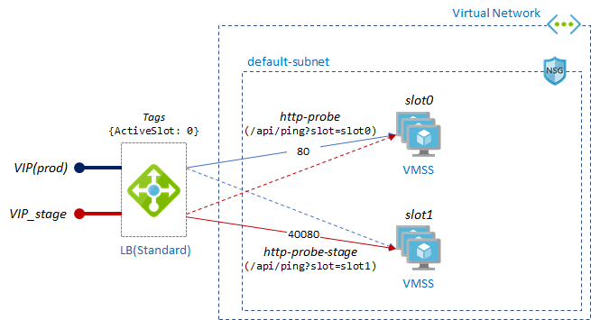

# VMSS VIP swap

## Background

For blue-green deployment, VIP swap is the one of well-known methods. VMSS does provide various deployment/update methods but it does not currently support VIP swap. There are some implementations of VIP swap for VMSS, such as [swapping IPs of two LBs](https://msftstack.wordpress.com/2017/02/24/vip-swap-blue-green-deployment-in-azure-resource-manager/) but this requires about ~1 min downtime.

## Architecture

Following architecture provides __NO downtime VIP swap__ with relatively simple implementation.



> The magic of VIP swap is by leveraging health-probe (`/api/ping?slot=slot0`) and controlling traffic to the right slot.

For more details:
- create a VIP(public IP) for production endpoint (port 80) and a VIP_stage for stage endpoint (port 40080).
- create two lb_rules for each slot.
- create an application that aware `/api/ping` endpoint and it returns 200 or 404 depends on its slot (e.g., slot is resolved by VMSS name).
- create a healthprobe for each slots.
    - `/api/ping?slot=slot0`
    - Active slot is managed by healthprobe
- set LB `tags` for showing which slot is activeslot (`ActvieSlot=0`)

### Other architecture option

If you want to access both prod and stage using the same 80 port, you can consider following:
- create two NICs on VM instance
- create two backend pools, say `pool0` (slot0/nic0 and slot1/nic1) and `pool1` (slot1/nic0 and slot0/nic1)
  - e.g pool0 - VMSS slot0 with primary nic, VMSS slot1 with secondary nic
- Since Azure does not assign a default gateway to secondary nic, set default gateway for secondary nic. see [documentation](https://docs.microsoft.com/en-us/azure/virtual-machines/windows/multiple-nics#configure-guest-os-for-multiple-nics) 

For more information, please refer additional [README.md](./terraform/multinic/README.md)

## Application

In order to VIP swap, application must implement `/api/ping` endpoint and it returns 200 or 404 depends on VMSS slot.

Here is how it's implemented.
- VM instance get a slot name from hostname when initializing.
- Using IMDS to get the hostname and parse the slot name from it.
    - You can use your own naming convention and parsing logic to get the right slot name. This example use `workload-prod-vmss-slot0` as a VMSS name.
- For dotnet, use [Singleton DI](https://docs.microsoft.com/en-us/aspnet/core/fundamentals/dependency-injection?view=aspnetcore-3.1) to get slot name one time only.

## Prep & Run

1. Package sample app by running `build.ps1`.
2. Build VM image using `packer`.
3. Update `terraform\variables.tf`.
4. You can choose __load balancer_ type by updating source in `main.tf`. Default is `plb`.

```
    source    = "./plb" # ["./appgw", "./plb", "./ilb"]
```
5. run terraform

```
terraform init
terraform apply
```

> Note: You must do `terraform init` again if you changed _load balancer_ type in `main.tf`.

## Test

For simple test, use `curl` to call api and swap VIP by changing healthprobe. (`/api/ping?slot=slot0` -> `/api/ping?slot=slot1`)

```
for i in {1..1000}; do out=$(curl -s --connect-timeout 2 -m 2 <app_vip>/api/test); t=$(date '+%H:%M:%S'); echo "$t $out"; sleep 1s; done
```

You'll see changing slot without downtime.

For more more thorough test, use load test tool like [Apache ab](http://httpd.apache.org/docs/current/programs/ab.html).

```
ab -n 10000 -c 50 http://<app_vip>/api/test
```

## Update(Deploy) image

To deploy new app package using VM image to stage slot, you can run following cli 

```
az vmss update -g vmsstf-rg -n api-prod-vmss-slot1 --set "virtualMachineProfile.storageProfile.imageReference.id=/subscriptions/_subs_id_/resourceGroups/test-vmss/providers/Microsoft.Compute/images/webapi002"
```

## Swap slot

You can swap slot using following `bash` script in Cloud Shell or similar environments.

```
m=$(az network lb show -g vmsstf-rg -n api-prod-vmss-lb --query "tags.ActiveSlot" -o tsv)
n=$(if [ $m -eq 0 ]; then echo 1; else echo 0; fi)
az network lb probe update -g vmsstf-rg --lb-name api-prod-vmss-lb -n http-probe --set "requestPath='/api/ping?slot=slot$n'"
az network lb probe update -g vmsstf-rg --lb-name api-prod-vmss-lb -n http-probe-stage --set "requestPath='/api/ping?slot=slot$m'"
az network lb update -g vmsstf-rg -n api-prod-vmss-lb --set "tags.ActiveSlot=$n"
```

## Using Application Gateway

If you're using __Application Gateway__ instead of public LB, you can also do the VIP-swap.
For more information see [terraform/appgw/](./terraform/appgw/).