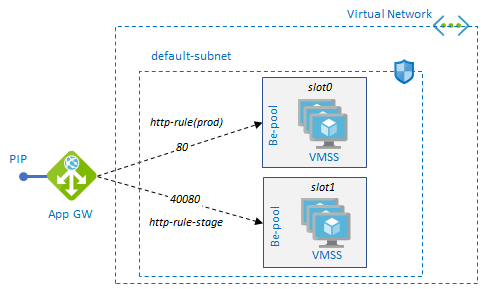

## VIP Swap with Application Gateway

VIP Swap Sample script for Application Gateway



For implementation of VIP Swap with App Gateway, see this [doc](https://docs.microsoft.com/en-us/azure/virtual-machine-scale-sets/virtual-machine-scale-sets-faq#how-do-i-do-a-vip-swap-for-virtual-machine-scale-sets-in-the-same-subscription-and-same-region)

### Run

1. Update __load balancer_ type to `./appgw` in `main.tf`.

```
    source    = "./appgw" # ["./appgw", "./plb", "./ilb"]
```
2. run `terraform apply` to create a test environment.

### Update/Deploy Image

Script for deploy an image to stage slot

```
# get active backendpool/prod slot
$id = (az network application-gateway rule show -g $vmssrgname --gateway-name $appgwname -n $httprulename --query "backendAddressPool.id" -o tsv)
$m = $id.Split("/")[-1][-1] # get slot number only
if ($m -eq "0") { $n = "1" } else { $n = "0" }

# update stage slot
az vmss update -g $vmssrgname -n "api-prod-vmss-slot$n" --set "virtualMachineProfile.storageProfile.imageReference.id=/subscriptions/$subscription_id/resourceGroups/$rgname/providers/Microsoft.Compute/images/app$Build.BuildId"
```

### Swap Slot

1. Swap stage and production slot by updating rules

> While App Gateway updates backend-pool, it may cause ~1 sec downtime.

```
# get current slot
$id = (az network application-gateway rule show -g $vmssrgname --gateway-name $appgwname -n $httprulename --query "backendAddressPool.id" -o tsv)
# "/subscriptions/.../resourceGroups/vmss/providers/Microsoft.Network/applicationGateways/appgw/backendAddressPools/slot0"
$m = $id.Split("/")[-1][-1] # get slot number only
if ($m -eq "0") { $n = "1" } else { $n = "0" }

# swap slot
az network application-gateway rule update -g $vmssrgname --gateway-name $appgwname -n $httprulename --address-pool "slot$n"
az network application-gateway rule update -g $vmssrgname --gateway-name $appgwname -n $httprulestagename --address-pool "slot$m"
```

2. No downtime swap by updating VMSS's app gateway backendpool property

Although this method swaps without downtime, it takes longer (~2 min) than previous methods and returns mixed responses of production and stage slot for a while. 

> This method is more like rolling-update than swap.

```
$slot0 = "/subscriptions/$subscription_id/resourceGroups/$vmssrgname/providers/Microsoft.Network/applicationGateways/$appgwname/backendAddressPools/slot0"
$slot1 = "/subscriptions/$subscription_id/resourceGroups/$vmssrgname/providers/Microsoft.Network/applicationGateways/$appgwname/backendAddressPools/slot1"

$id = (az network application-gateway address-pool show -g $vmssrgname --gateway-name $appgwname -n $prodslot --query "backendIpConfigurations[0].id" -o tsv)
$m = $id.Split("/")[-1][-1] # get slot number only
if ($m -eq "0") { $n = "1" } else { $n = "0" }

az vmss update -g $vmssrgname -n "api-prod-vmss-slot$n" --set "virtualMachineProfile.networkProfile.networkInterfaceConfigurations[0].ipConfigurations[0].applicationGatewayBackendAddressPools[0].id=$slot0"
az vmss update -g $vmssrgname -n "api-prod-vmss-slot$m" --set "virtualMachineProfile.networkProfile.networkInterfaceConfigurations[0].ipConfigurations[0].applicationGatewayBackendAddressPools[0].id=$slot1"
```